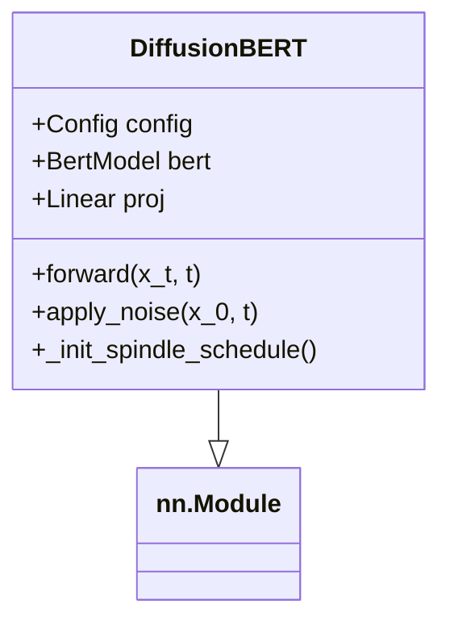

# 5D-BERT项目详解

## 项目概述
5D-BERT是一个结合扩散模型(Diffusion Model)和BERT的文本生成模型。它通过创新的"纺锤形噪声调度"(spindle noise schedule)来控制文本生成过程，相比传统方法能产生更高质量的文本。

## 文件结构说明

### 1. config.py - 配置管理
```python
from dataclasses import dataclass

@dataclass  # 使用Python数据类自动生成常用方法
class Config:
    # 扩散过程参数
    diffusion_steps: int = 2048  # 扩散过程总步数(必须与预训练模型匹配)
    lambda_val: float = 0.7     # 纺锤形调度参数，控制噪声曲线形状
    
    # 模型架构参数
    hidden_size: int = 768      # BERT隐藏层维度(768是标准BERT-base的尺寸)
    num_attention_heads: int = 12  # 注意力头数(标准BERT配置)
    num_hidden_layers: int = 12    # Transformer层数(标准BERT配置)
    
    # 训练参数
    batch_size: int = 32        # 每批训练数据量
    learning_rate: float = 3e-6 # 学习率(较小的值适合微调)
    warmup_steps: int = 10000   # 学习率预热步数
    
    # 生成参数
    max_seq_length: int = 128   # 生成文本最大长度
    top_k: int = 50             # 采样时保留概率最高的k个token
    top_p: float = 0.95         # 核采样阈值(累计概率超过p的token会被过滤)
    temperature: float = 1.0    # 温度参数(>1增加多样性，<1减少随机性)
    repetition_penalty: float = 1.5  # 重复惩罚因子(>1降低重复token概率)
    
    def __post_init__(self):
        # 配置参数验证
        assert self.diffusion_steps > 0  # 扩散步数必须为正
        assert 0 < self.lambda_val <= 1.0  # lambda必须在(0,1]区间
```

### 2. model.py - 核心模型实现
```python
import torch
import torch.nn as nn
from transformers import BertModel
from config import Config

class DiffusionBERT(nn.Module):
    def __init__(self, config: Config):
        super().__init__()  # 初始化父类nn.Module
        self.config = config  # 保存配置
        
        # 加载预训练BERT模型(bert-base-uncased)
        self.bert = BertModel.from_pretrained('bert-base-uncased')
        # 设置BERT所有参数可训练(默认BERT参数是冻结的)
        for param in self.bert.parameters():
            param.requires_grad = True
        
        # 注册缓冲区保存alpha值(不参与梯度更新)
        self.register_buffer('alpha', torch.zeros(config.diffusion_steps))
        self._init_spindle_schedule()  # 初始化噪声调度
        
        # 投影层:将BERT输出(768维)映射到词汇表大小(30522)
        self.proj = nn.Linear(768, 30522)  
    
    def _init_spindle_schedule(self):
        """初始化纺锤形噪声调度"""
        T = self.config.diffusion_steps  # 总扩散步数
        lambda_val = self.config.lambda_val  # 调度形状参数
        
        # 预计算每个步骤的alpha值
        for t in range(1, T+1):
            # 纺锤形调度公式: αₜ = 1 - t/T - λ·sin(πt/T)
            self.alpha[t-1] = 1 - t/T - lambda_val * torch.sin(torch.tensor(t * torch.pi / T))
    
    def forward(self, x_t, t=None):
        """
        前向传播:预测x_{t-1}
        x_t: 当前步骤的带噪输入 [batch_size, seq_len]
        t: 当前扩散步骤(可为None实现时间无关解码)
        """
        # 时间无关解码:通过掩码比例推断t
        if t is None:
            mask_ratio = (x_t == 0).float().mean()  # 计算[MASK]token比例
            t = torch.round((1 - mask_ratio) * self.config.diffusion_steps).long()
        
        # 确保输入是2D [batch_size, seq_len]
        if x_t.dim() == 1:
            x_t = x_t.unsqueeze(0)
        
        # 处理时间步t的格式
        if isinstance(t, int):
            t = torch.tensor([t], device=x_t.device)
        elif t.dim() == 0:
            t = t.unsqueeze(0)
            
        # 创建注意力掩码(0表示padding位置)
        attention_mask = (x_t != 0).long()
        
        # 获取BERT编码(最后一层隐藏状态)
        outputs = self.bert(input_ids=x_t, attention_mask=attention_mask)
        hidden_states = outputs.last_hidden_state
        
        # 投影到词汇表空间
        return self.proj(hidden_states)
    
    def apply_noise(self, x_0, t):
        """对x_0在步骤t添加噪声"""
        alpha_t = self.alpha[t-1].to(x_0.device)  # 获取当前步骤的alpha值
        mask_prob = 1 - alpha_t  # 计算掩码概率
        
        # 创建随机掩码(形状与x_0相同)
        mask = torch.rand_like(x_0.float()) < mask_prob.view(-1, 1)
        x_t = x_0.clone()
        x_t[mask] = 0  # 0表示[MASK]token
        
        return x_t
```

### 3. train.py - 训练流程
```python
import torch
import torch.optim as optim
from torch.utils.data import Dataset, DataLoader
from model import DiffusionBERT
from config import Config
from transformers import BertTokenizer

class TextDataset(Dataset):
    """文本数据集处理类"""
    def __init__(self, texts, tokenizer, max_length=128):
        self.texts = texts  # 原始文本列表
        self.tokenizer = tokenizer  # BERT tokenizer
        self.max_length = max_length  # 最大序列长度
    
    def __len__(self):
        return len(self.texts)  # 返回样本总数
    
    def __getitem__(self, idx):
        # 对文本进行tokenize处理
        encoding = self.tokenizer(
            self.texts[idx],  # 当前文本
            max_length=self.max_length,  # 最大长度
            padding='max_length',  # 填充到max_length
            truncation=True,  # 超长截断
            return_tensors='pt'  # 返回PyTorch张量
        )
        return encoding.input_ids.squeeze(0)  # 去除batch维度

def train(config: Config):
    # 初始化模型和tokenizer(带重试机制)
    try:
        model = DiffusionBERT(config)  # 创建DiffusionBERT模型
        tokenizer = BertTokenizer.from_pretrained('bert-base-uncased') 
    except Exception as e:
        print(f"加载BERT模型失败: {e}")
        return
    
    # 创建训练数据(示例)
    train_texts = ["示例句子1", "示例句子2"]
    train_dataset = TextDataset(train_texts, tokenizer, config.max_seq_length)
    train_loader = DataLoader(train_dataset, batch_size=config.batch_size, shuffle=True)
    
    # 使用AdamW优化器
    optimizer = optim.AdamW(model.parameters(), lr=config.learning_rate)
    
    # 训练循环
    model.train()  # 设置模型为训练模式
    for epoch in range(10):  # 训练10个epoch
        for batch in train_loader:
            # 随机采样扩散步骤(1到diffusion_steps之间)
            t = torch.randint(1, config.diffusion_steps, (batch.size(0),))
            
            # 对batch添加噪声(得到x_t)
            x_t = model.apply_noise(batch, t)
            
            # 模型预测x_{t-1}
            pred = model(x_t, t)
            
            # 计算交叉熵损失
            loss = torch.nn.functional.cross_entropy(
                pred.view(-1, pred.size(-1)),  # 展平预测结果
                batch.view(-1)  # 展平真实标签
            )
            
            # 反向传播
            optimizer.zero_grad()  # 清空梯度
            loss.backward()  # 计算梯度
            optimizer.step()  # 更新参数
            
            print(f"Epoch {epoch}, Loss: {loss.item():.4f}")
    
    # 保存模型权重
    torch.save(model.state_dict(), "diffusion_bert.pth")
```

### 4. generate.py - 文本生成
```python
import torch
from transformers import BertTokenizer
from model import DiffusionBERT
from config import Config

def generate(config: Config, model_path="diffusion_bert.pth"):
    # 初始化模型
    model = DiffusionBERT(config)
    model.load_state_dict(torch.load(model_path))  # 加载预训练权重
    
    # 初始化BERT tokenizer
    tokenizer = BertTokenizer.from_pretrained('bert-base-uncased')
    
    # 从[CLS]token开始生成(101是[CLS]的token id)
    input_ids = torch.tensor([[101]], dtype=torch.long)  
    
    # 禁用梯度计算(生成阶段)
    with torch.no_grad():
        # 模型预测(使用第一步t=1)
        pred = model(input_ids, torch.tensor([1], device=input_ids.device))
        
        # 获取top-k预测token
        _, top_indices = torch.topk(pred, k=10, dim=-1)
        
        # 选择第一个预测token(简单示例)
        input_ids = top_indices[0,0,0].unsqueeze(0).unsqueeze(0)
        
        # 解码生成文本
        token_ids = [input_ids.item()]
        generated_text = tokenizer.decode(token_ids, skip_special_tokens=True)
        
        print(f"生成文本: {generated_text}")
        return generated_text
```
```python
@dataclass
class Config:
    diffusion_steps: int = 2048  # 扩散步骤数
    lambda_val: float = 0.7     # 纺锤形调度参数
    hidden_size: int = 768      # BERT隐藏层大小
    # ...其他配置参数
```

主要功能：
- 集中管理所有模型参数
- 包含扩散过程、模型架构、训练和生成参数
- 提供参数验证功能

### 2. model.py - 核心模型实现

#### DiffusionBERT类结构


关键方法说明：
1. `_init_spindle_schedule()`: 初始化纺锤形噪声调度
   - 公式: αₜ = 1 - t/T - λ·sin(πt/T)
   - 其中λ是config.lambda_val

2. `apply_noise(x_0, t)`: 对输入x_0在步骤t添加噪声
   - 使用纺锤形调度控制噪声比例
   - 通过掩码方式实现(0表示[MASK]token)

3. `forward(x_t, t)`: 预测x_{t-1}
   - 支持时间无关解码(t=None时自动推断t)
   - 使用BERT获取隐藏表示
   - 通过投影层输出词汇表分布

### 3. train.py - 训练流程

训练过程伪代码：
```python
初始化模型和tokenizer
加载数据集
for epoch in 轮次数:
    for batch in 数据批次:
        t = 随机采样扩散步骤
        x_t = 对batch添加步骤t的噪声
        pred = 模型预测x_{t-1}
        计算交叉熵损失
        反向传播更新参数
保存模型
```

关键点：
- 使用TextDataset处理文本数据
- 随机采样扩散步骤进行训练
- 交叉熵损失函数

### 4. generate.py - 文本生成

生成流程：
1. 加载预训练模型
2. 从[CLS]token开始
3. 逐步预测下一个token
4. 使用top-k采样选择token
5. 重复直到生成完整文本

## 核心算法解析

### 纺锤形噪声调度
与传统线性调度不同，纺锤形调度通过正弦函数引入非线性：
```
αₜ = 1 - t/T - λ·sin(πt/T)
```
特点：
- 中间步骤噪声变化更快
- 开始和结束阶段变化平缓
- 通过λ控制曲线形状

### 时间无关解码
模型可以自动推断扩散步骤t：
```python
if t is None:
    mask_ratio = (x_t == 0).float().mean()  # 计算掩码比例
    t = 根据mask_ratio推算步骤
```

## 使用示例

### 训练模型
```bash
python train.py
```

### 生成文本
```bash
python generate.py
```

## 扩展建议
1. 使用更大规模的数据集
2. 尝试不同的噪声调度策略
3. 实现完整的自回归生成过程
4. 添加评估指标
